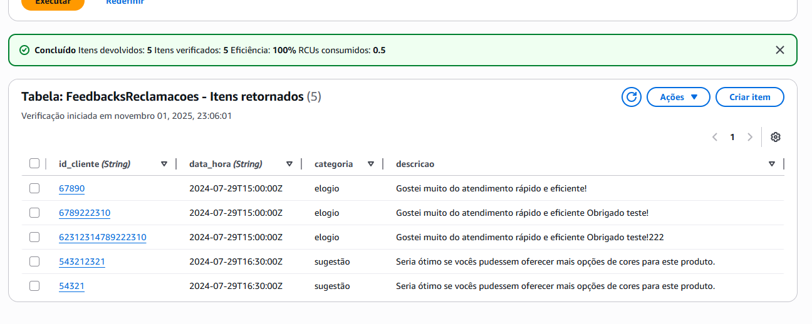
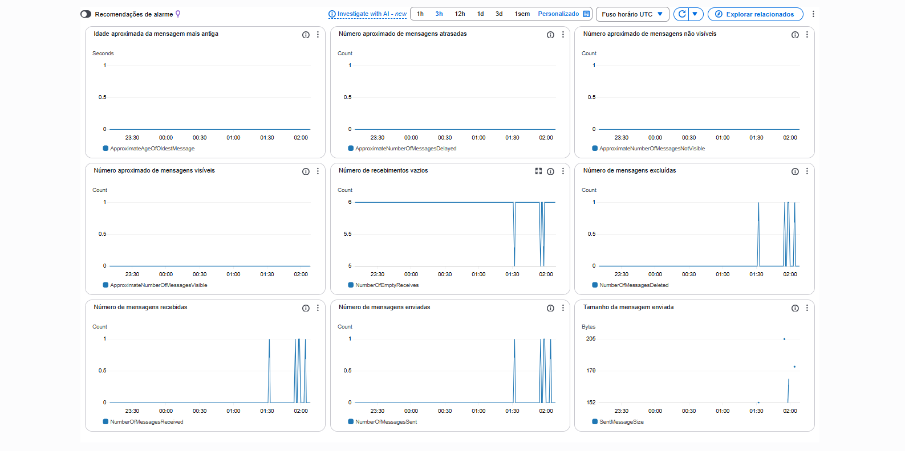
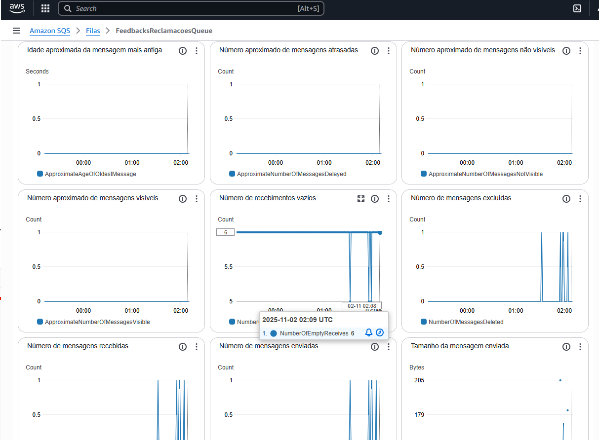

# Atividade Final - Instruções


### Descrição do Problema de Negócio
Uma empresa de e-commerce deseja melhorar o processo de atendimento ao cliente, especificamente no que diz respeito ao gerenciamento de feedbacks e reclamações. Atualmente, o processo é manual e demorado, o que resulta em uma experiência insatisfatória para os clientes e em uma sobrecarga para a equipe de atendimento.


### Objetivo
Desenvolver uma solução serverless utilizando Amazon API Gateway, AWS Lambda e Amazon SQS para automatizar o recebimento, processamento e armazenamento de feedbacks e reclamações dos clientes, melhorando a eficiência do atendimento e a satisfação dos clientes.


##### Requisitos do Sistema

1. Recebimento de Feedbacks/Reclamações:

   - Criação de uma API RESTful usando Amazon API Gateway para receber feedbacks/reclamações dos clientes.
   - A API deve aceitar apenas solicitações HTTP POST com detalhes do feedback/reclamação, como ID do cliente, descrição, categoria (elogio, reclamação, sugestão), e data/hora. Qualquer outro formatou ou campo adicional deve ser rejeitado.
   - A API deve validar os dados recebidos utilizando JSON Schema para garantir que todas as informações obrigatórias estejam presentes e corretas.

2. Processamento de Feedbacks/Reclamações:

   - Utilização de AWS Lambda para processar as solicitações recebidas pela API.
   - A Lambda deve enviar os detalhes para uma fila SQS para processamento posterior.

3. Armazenamento e Notificação:

   - Implementação de outra função Lambda que será desencadeada pela fila SQS.
   - Esta Lambda deve armazenar os detalhes do feedback/reclamação em um banco de dados (por exemplo, Amazon DynamoDB) e enviar uma notificação para a equipe de atendimento via email ou outro serviço de notificação.


##### Passos para Implementação

1. Configuração do Amazon API Gateway:

   - Crie uma nova API RESTful no Amazon API Gateway.
   Defina um endpoint HTTP POST para receber os feedbacks/reclamações.
   - Configure a integração com a função AWS Lambda que processará a solicitação.
   - Valide as chamadas via json schema diretamente no gateway.

2. Desenvolvimento da Função AWS Lambda (Recebimento e Validação):

   - Crie uma função Lambda que será invocada pelo API Gateway.
   - Envie os dados válidos para uma fila SQS.

3. Configuração do Amazon SQS:

   - Crie uma fila SQS para armazenar os feedbacks/reclamações recebidos.
   - Anote a URL da fila para uso na função Lambda.
  
4. Desenvolvimento da Função AWS Lambda (Processamento e Armazenamento):

   - Crie uma função Lambda que será acionada pelas mensagens na fila SQS.
   - A função deve armazenar os dados em um banco de dados como o DynamoDB e enviar uma notificação.


#### Exemplos de chamada da API

```json

{
    "id_cliente": "12345",
    "descricao": "O produto chegou com defeito e não funciona corretamente.",
    "categoria": "reclamação",
    "data_hora": "2024-07-29T14:48:00Z"
}
``` 
```json
{
    "id_cliente": "67890",
    "descricao": "Gostei muito do atendimento rápido e eficiente!",
    "categoria": "elogio",
    "data_hora": "2024-07-29T15:00:00Z"
}
```

```json
{
    "id_cliente": "54321",
    "descricao": "Seria ótimo se vocês pudessem oferecer mais opções de cores para este produto.",
    "categoria": "sugestão",
    "data_hora": "2024-07-29T16:30:00Z"
}
```

##### Como criar APIs via serverless framework

```yaml
# Dentro do serverless.yml
functions:
  hello:
    handler: handler.hello
    events:
      - http:
          path: hello
          method: post
          cors: true
```


##### Como adicionar modelos de validação em json schema no serverless framework

[documentação - request-schema-validators](https://www.serverless.com/framework/docs/providers/aws/events/apigateway#request-schema-validators)

```yaml
# Dentro do serverless.yml
functions:
  create:
    handler: posts.create
    events:
      - http:
          path: posts/create
          method: post
          request:
            schemas:
              application/json: ${file(create_request.json)}
```

#### Como criar uma fila SQS via CLI

``` bash
aws sqs create-queue --queue-name FeedbacksReclamacoesQueue
```

#### Como criar um DynamoDB via CLI

``` bash
aws dynamodb create-table \
   --table-name FeedbacksReclamacoes \
   --attribute-definitions AttributeName=id_cliente,AttributeType=S AttributeName=data_hora,AttributeType=S \
   --key-schema AttributeName=id_cliente,KeyType=HASH AttributeName=data_hora,KeyType=RANGE \
   --provisioned-throughput ReadCapacityUnits=5,WriteCapacityUnits=5
```

#### código em python para inserir itens no DynamoDB com ID dinamico

```python
import boto3
import uuid

dynamodb = boto3.resource('dynamodb')
table = dynamodb.Table('FeedbacksReclamacoes')

def inserir_feedback(id_cliente, descricao, categoria, data_hora):
    response = table.put_item(
        Item={
            'id_cliente': id_cliente,
            'descricao': descricao,
            'categoria': categoria,
            'data_hora': data_hora
        }
    )
    return response
```

#### Dicas

- Lembre de validar o conteúdo da requisição via Json Schema e que o campo categoria pode reseceber apenas 3 valores (elogio, reclamação, sugestão).
- Lembre de não permitir que propriedades não descritas no json schema sejam aceitas na requisição e validar os campos obrigatórios.
- Todos os códigos de exemplo estão disponíveis no repositório do GitHub em python, mas caso deseje, pode utilizar outra linguagem de programação disponivel para AWS Lambda.
- A atividade pode ser desenvolvida totalmente em serverless framework ou utilizando a console da AWS. Recomendo que utilize serverless framework para facilitar a criação e deploy das funções Lambda e suas triggers.
- O nome do DynamoDB deve ser "<b>FeedbacksReclamacoes</b>" e o nome da fila SQS deve ser "<b>FeedbacksReclamacoesQueue</b>".

#### Critérios de Avaliação

- Funcionalidade: A API deve funcionar conforme o esperado, processando e armazenando feedbacks/reclamações.
- Validação: A validação do JSON Schema deve ser implementada corretamente.
- Uso de Serviços AWS: A solução deve utilizar corretamente os serviços AWS mencionados (API Gateway, Lambda, SQS, DynamoDB).
- Construir com serverless framework as funções Lambda e suas triggers e a API.
- SQS e DynamoDB podem ser criados via console ou CLI.

#### Entrega

1. Monte um zip com:
     1. Serverless.yml e arquivos em python (ou outra linguagem nativamente suportada pelo Lambda) das funções Lambda.
     2. Print da tabela do DynamoDB com os dados inseridos.

      
     


     3. Print da fila SQS com as mensagens processadas. 
     
     
     


     
2. Suba o zip no portal da FIAP.
